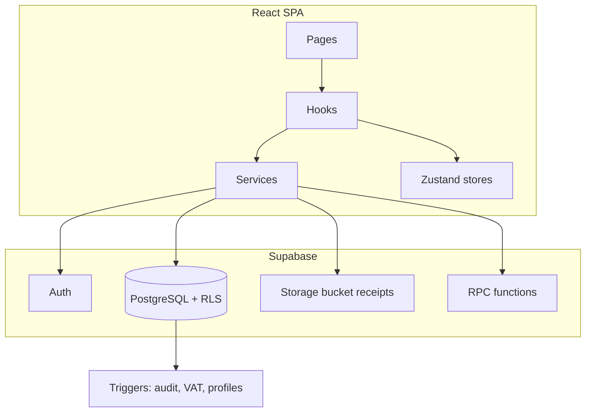

# Expensio Business — System Documentation

Internal finance and project monitoring web application for a construction company. The system replaces four legacy Excel workbooks with a unified React front end backed by Supabase (PostgreSQL, Auth, Row Level Security, and Storage).

---

## Table of contents

1. [Purpose and scope](#purpose-and-scope)
2. [Technology stack](#technology-stack)
3. [High-level architecture](#high-level-architecture)
4. [Front-end design](#front-end-design)
5. [Features by module](#features-by-module)
6. [Authentication and authorization](#authentication-and-authorization)
7. [Data model](#data-model)
8. [Supabase backend](#supabase-backend)
9. [Excel import and export](#excel-import-and-export)
10. [UI and visual design](#ui-and-visual-design)
11. [Configuration and operations](#configuration-and-operations)

---

## Purpose and scope

Expensio Business centralizes operational finance data that was previously maintained in separate spreadsheets:

| Legacy workbook | Application module |
|-----------------|-------------------|
| Daily Expenses | Daily Expenses |
| Payroll | Payroll |
| Project Expenses | Project Expenses |
| Project Monitoring (contracted reports) | Project Monitoring |

Additional capabilities beyond Excel parity include:

- **Projects** — master registry with lifecycle status
- **Dashboard** — year-scoped KPIs and charts
- **Approvals** — queue for expenses, payroll, and monitoring reports
- **Audit logs** — immutable change history
- **Admin** — user roles and application settings

---

## Technology stack

| Layer | Technology |
|-------|------------|
| UI | React 19, TypeScript, Vite 8 |
| Styling | Tailwind CSS 3, shadcn-style UI primitives (`src/components/ui`) |
| Routing | React Router 7 |
| Server state | TanStack Query 5 |
| Client state | Zustand 5 (auth session, sidebar collapse) |
| Forms / validation | React Hook Form, Zod, `@hookform/resolvers` |
| Charts | Recharts 3 |
| Spreadsheets | SheetJS (`xlsx`) |
| Backend | Supabase JS client — PostgreSQL, Auth, RLS, Storage |
| Notifications | Sonner |

Environment variables (see `.env.example`):

- `VITE_SUPABASE_URL`
- `VITE_SUPABASE_ANON_KEY`

---

## High-level architecture



**Request flow:** UI pages call custom hooks; hooks wrap TanStack Query mutations/queries and delegate to service modules in `src/services/`. Services use the singleton Supabase client from `src/lib/supabase.ts`. Authorization is enforced twice: client-side via `PermissionGuard` / `useRole`, and server-side via PostgreSQL RLS policies.

**Path alias:** `@/` resolves to `src/` (configured in `vite.config.ts`).

---

## Front-end design

### Directory layout

```
src/
├── components/     # UI building blocks
│   ├── layout/     # AppLayout, Sidebar, TopBar, PageHeader
│   ├── charts/     # Recharts wrappers for dashboard
│   ├── forms/      # ProjectSelect, CurrencyInput
│   ├── badges/     # ApprovalBadge
│   ├── cards/      # StatCard
│   ├── shared/     # PermissionGuard, LoadingSpinner, EmptyState
│   └── ui/         # Button, Card, Input, Badge, Skeleton, Label
├── hooks/          # One hook file per domain (useProjects, usePayroll, …)
├── pages/          # Route-level screens grouped by feature
├── services/       # Supabase CRUD and RPC calls
│   └── excel/      # importer.ts, exporter.ts
├── store/          # authStore, uiStore
├── lib/            # supabase client, permissions, constants, excelLayouts
└── types/          # Shared TypeScript models
```

### Routing (`src/App.tsx`)

| Path | Page | Access |
|------|------|--------|
| `/login` | Login | Public |
| `/dashboard` | Dashboard | Authenticated |
| `/projects`, `/projects/new`, `/projects/:id`, `/projects/:id/edit` | Projects | Authenticated |
| `/project-monitoring` | Project Monitoring | Authenticated |
| `/daily-expenses` | Daily Expenses | Authenticated |
| `/project-expenses` | Project Expenses | Authenticated |
| `/payroll` | Payroll | Authenticated |
| `/approvals` | Approval Queue | `canApprove` |
| `/audit` | Audit Logs | `canViewAudit` |
| `/admin/*` | Users & Settings | `canConfigureSettings` |

Unauthenticated users are redirected to `/login`. The root path redirects to `/dashboard`.

### Layout shell

`AppLayout` renders a collapsible **Sidebar** (primary navigation), **TopBar** (user context / sign-out), and a scrollable **main** area for nested routes via `<Outlet />`.

Sidebar links are always visible for core modules; Approvals, Audit, and Admin appear only when the current role’s permissions allow them.

### State management patterns

| Concern | Implementation |
|---------|----------------|
| Auth session + profile | `authStore` — initializes on app mount, subscribes to `onAuthStateChange` |
| Sidebar collapsed | `uiStore` |
| Remote data | TanStack Query — query keys per entity and filter set |
| Mutations | `useMutation` in domain hooks; invalidate related queries on success |

---

## Features by module

### Dashboard

- Year selector drives all aggregates.
- **Stat cards:** total expenses YTD, payroll YTD, active project count, amount collected, outstanding balance, yearly profit (from `get_dashboard_summary` RPC).
- **Charts:** monthly expenses, project profitability, payment aging, payroll trend by period, expense category breakdown.
- **Alerts:** overdue or partially paid client invoices.

### Projects

- CRUD for projects with business key (`project_id`), name, and status (`quotation` → `archived`).
- Soft delete via `deleted_at`.
- Detail view for a single project; create/edit form shared at `/projects/new` and `/projects/:id/edit`.

### Project monitoring

- Annual **contracted reports** aligned with Excel `CONTRACTED REPORT {year}` layouts.
- Each report stores client, dates, accomplishment %, contracted/tax/collected amounts, 17 expense category columns, computed `total_expenses`, and generated `profit` / `balance_to_be_collected`.
- **Aggregate expenses:** rolls up approved daily expenses by `expense_category_code` into PMR columns for a year (`projectMonitoringService.aggregateExpensesIntoReport`).
- Import/export Excel; optional report approval workflow when enabled in settings.

### Daily expenses

- Line-item expenses per project: date, particulars, cash out, VAT rate (auto-calculated VAT in DB), category, optional receipt/invoice URLs.
- Filters: year, month, project, category.
- Inline create form; soft delete.
- Excel import (sample single-sheet or monthly sheet layouts) and export grouped by month.

### Project expenses

- Simpler expense lines (no VAT/category rollup to PMR in the same way as daily expenses).
- Project-scoped listing, CRUD, import/export matching legacy positional column sheets.

### Payroll

- One row per worker per year per project; **24 bi-monthly period columns** (Jan 15 / Jan 31, …, Dec 31).
- `total_payroll` is a generated column summing all periods.
- Worker type: `employee` or `organization`.
- Optional **payroll lock** (`is_locked`) when `payroll_lock_enabled` in app settings.
- Excel import detects `PAYROLL SUMMARY` header layout or generic year sheets.

### Approvals

- Central **approval_queue** table references entity type and id (`daily_expense`, `project_expense`, `payroll`, `project_monitoring_report`).
- Tabs: pending, approved, rejected.
- Approvers (owner, finance_manager, developer) can approve or reject; updates propagate to the underlying entity’s `approval_status`.

### Audit logs

- Read-only list of immutable `audit_logs` rows for users with `canViewAudit`.
- Populated automatically by database triggers on INSERT/UPDATE/DELETE for key tables.

### Admin

- **Users** (`/admin/users`): manage `user_profiles` — roles and active flag (owner/developer only).
- **Settings** (`/admin/settings`): toggles for expense approvals, payroll lock, report approvals; default VAT rate.

---

## Authentication and authorization

### Authentication

- **Email/password** sign-in via `supabase.auth.signInWithPassword`.
- **Google OAuth** via `signInWithOAuth` (redirect back to app origin).
- On signup, trigger `handle_new_user` creates a `user_profiles` row with role `guest` (see migration `007_fix_auth_signup.sql` if signup fails due to RLS).
- First admin: promote via SQL — `UPDATE user_profiles SET role = 'owner' WHERE email = '…'`.

### Roles and client permissions

Defined in `src/lib/permissions.ts`:

| Role | View | Create/Edit/Delete | Approve | Export | Audit | Settings |
|------|------|-------------------|---------|--------|-------|----------|
| owner | Yes | Yes | Yes | Yes | Yes | Yes |
| developer | Yes | Yes | Yes | Yes | Yes | Yes |
| finance_manager | Yes | Yes | Yes | Yes | Yes | No |
| accountant | Yes | Yes | No | Yes | Yes | No |
| guest | Yes | No | No | No | No | No |

`useRole()` reads the profile from `authStore` and returns `getPermissions(role)`.

`PermissionGuard` hides children when a permission flag is false (used for routes, buttons, and export/import actions).

### Server-side authorization (RLS)

Helper functions in PostgreSQL:

- `get_my_role()` — current user’s role from `user_profiles`
- `is_write_role()` — owner, finance_manager, accountant, developer
- `is_admin_role()` — owner, developer
- `is_approver_role()` — owner, finance_manager, developer

All application tables have RLS enabled. Typical pattern: authenticated users can SELECT; writes require `is_write_role()`; admin tables require `is_admin_role()`. Audit logs are append-only (no UPDATE/DELETE policies for clients).

---

## Data model

### Core entities

| Table | Purpose |
|-------|---------|
| `user_profiles` | Extends `auth.users` with role, name, active flag |
| `app_settings` | Singleton feature flags and default VAT |
| `expense_categories` | Canonical category codes mapped to PMR columns |
| `projects` | Master project registry |
| `client_invoices` | Client billing and payment status |
| `project_monitoring_reports` | Annual contracted reports per project |
| `daily_expenses` | Operational daily cash-out lines |
| `project_expenses` | Project-level expense register |
| `payroll` | Bi-monthly payroll grid per worker |
| `approval_queue` | Cross-entity approval workflow |
| `audit_logs` | Immutable audit trail |

### Notable schema behaviors

- **Soft deletes:** `deleted_at` on projects, expenses, payroll, PMR, invoices.
- **Generated columns:** PMR `balance_to_be_collected`, `profit`; payroll `total_payroll`.
- **VAT:** `daily_expenses.vat` computed in trigger `calc_expense_vat` from `cash_out * vat_rate`.
- **Invoice status:** updated by `update_invoice_status` when payments or due dates change.
- **Category → PMR mapping:** `EXPENSE_CATEGORY_TO_PMR_COLUMN` in `src/types/index.ts` links daily expense category codes to PMR numeric columns.

### Enums

`user_role`, `project_status`, `invoice_status`, `approval_status`, `approval_entity`, `currency_code` — defined in `001_schema.sql`.

---

## Supabase backend

### Migrations (apply in order)

| File | Contents |
|------|----------|
| `001_schema.sql` | Tables, enums, indexes, seed categories |
| `002_rls.sql` | RLS policies and role helper functions |
| `003_functions.sql` | `recalculate_report_totals`, `update_invoice_status`, `get_dashboard_summary`, `get_monthly_expenses` |
| `004_triggers.sql` | `updated_at`, signup profile, audit logging, VAT, invoice status |
| `005_seed.sql` | Optional seed data |
| `006_storage_receipts.sql` | Storage policy examples for `receipts` bucket |
| `007_fix_auth_signup.sql` | Hardened `handle_new_user` for RLS/signup errors |

### Database functions used by the app

- `get_dashboard_summary(p_year)` — dashboard KPIs
- `get_monthly_expenses(p_year)` — monthly chart data
- `recalculate_report_totals(p_report_id)` — sum PMR expense columns into `total_expenses`

### Triggers

- **`set_updated_at`** — maintains `updated_at` on mutable tables
- **`handle_new_user`** — profile row on auth signup
- **`audit_log_trigger`** — writes JSON snapshots to `audit_logs` for projects, PMR, daily/project expenses, payroll, invoices, approval_queue
- **`calc_expense_vat`** — daily expense VAT
- **`trigger_invoice_status`** — keeps invoice status in sync

### Storage

Private bucket **`receipts`** (recommended 10 MB limit) for `receipt_url` / `invoice_url` on expense records. Policies in `006_storage_receipts.sql` are commented templates; configure in Supabase Dashboard or via SQL after bucket creation.

---

## Excel import and export

### Design goals

Import/export layouts mirror sample workbooks under `src/assets/sample/`. Layout detection lives in `src/lib/excelLayouts.ts` (`detectWorkbookLayout`, header normalization, payroll date → column mapping).

### Workbook types

| Module | Detected layouts | Key headers / structure |
|--------|------------------|-------------------------|
| Daily expenses | `daily_expenses_sample`, `daily_expenses_monthly` | `DATE`, `CASH OUT`; or month-named sheets |
| Payroll | `payroll_summary`, `payroll_generic` | `PAYROLL SUMMARY` 3-row header with pay dates |
| Project expenses | Per-project sheets | Positional columns |
| Project monitoring | `pmr_contracted_report` | `CONTRACTED REPORT {year}`, row-2 headers per `PMR_SAMPLE_ROW2_HEADERS` |

### Implementation

- **`src/services/excel/importer.ts`** — parses uploads, returns `ImportResult` with `valid` rows and per-row `errors`.
- **`src/services/excel/exporter.ts`** — builds workbooks and triggers browser download.
- **`useExcel.ts`** — re-exports import/export functions for convenience.
- **`npm run audit:excel`** — `scripts/audit-excel-samples.mjs` validates sample file structure against expected layouts.

Export is gated by `canExport`; import/create actions by `canCreate`.

---

## UI and visual design

### Theme

Tailwind extended palette (`tailwind.config.ts`):

- **Primary:** `#1e3a5f` (navy) with `primary-light` / `primary-dark`
- **Accent:** amber (`#f59e0b`) — active nav indicator, highlights
- **Semantic CSS variables:** background, foreground, muted, card, destructive (HSL tokens in `index.css`)

### Components

- **StatCard** — currency or count KPIs with variants (`default`, `success`, `warning`, `danger`).
- **ApprovalBadge** — visual status for pending/approved/rejected records.
- **Charts** — consistent card wrappers; dashboard uses Recharts bar, line, and pie visualizations.
- **Typography** — `JetBrains Mono` for monospace IDs; otherwise system sans via Tailwind defaults.

### UX patterns

- Toast feedback via Sonner (`success` / `error` on mutations).
- Loading states with `LoadingSpinner` on heavy queries.
- Collapsible sidebar preserves icon-only mode on narrow preference.
- Login page: centered card on primary gradient background.

---

## Configuration and operations

### Local development

```bash
cp .env.example .env.local   # set Supabase URL and anon key
supabase db push             # or run migrations 001–007 in SQL editor
npm install
npm run dev
```

Create the `receipts` storage bucket in Supabase if using file attachments.

### Production build

```bash
npm run build    # outputs to dist/
npm run preview  # local preview of production bundle
```

Deploy `dist/` to a static host (Vercel, Netlify, etc.) with the same `VITE_*` environment variables.

### Application settings (runtime)

| Setting | Effect |
|---------|--------|
| `expense_approvals_enabled` | Gates expense approval workflow |
| `payroll_lock_enabled` | Enables payroll row locking |
| `report_approval_enabled` | Gates PMR report approvals |
| `default_vat_rate` | Default for new daily expenses (e.g. 0.12) |

### Related documentation

- Project setup summary: [README.md](../README.md)
- Sample Excel audit: `npm run audit:excel`

---

*Last updated to reflect the codebase as of the current migration set (001–007) and React application structure.*
