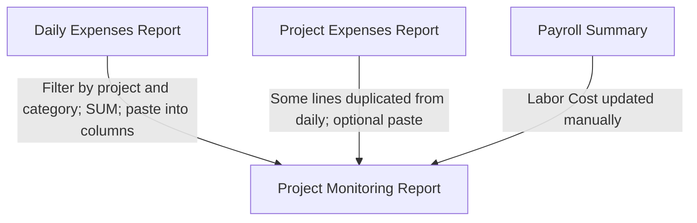

# Expensio Business User Manual

**Enterprise Financial Operations** — a guide for financial managers who record expenses, payroll, and project monitoring data for a construction company.

| | |
|---|---|
| **Version** | 1.0 |
| **Last updated** | May 25, 2026 |
| **Primary audience** | Users with the **Finance Manager** role |
| **Also useful for** | Accountants (read/create; no Approvals menu) |

---

## Table of contents

1. [Introduction](#1-introduction)
2. [How finance work used to be done (Excel)](#2-how-finance-work-used-to-be-done-excel)
3. [The old copy-and-paste problem](#3-the-old-copy-and-paste-problem)
4. [How Expensio Business helps](#4-how-expensio-business-helps)
5. [Getting started](#5-getting-started)
6. [Your role as Finance Manager](#6-your-role-as-finance-manager)
7. [Recommended workflow](#7-recommended-workflow)
8. [Module guides](#8-module-guides)
9. [Excel import and export](#9-excel-import-and-export)
10. [Approvals](#10-approvals)
11. [Audit logs](#11-audit-logs)
12. [Glossary](#12-glossary)
13. [Appendix A — Category mapping](#appendix-a--category-mapping-daily-expenses-to-project-monitoring)
14. [Appendix B — Troubleshooting](#appendix-b--troubleshooting)
15. [Document history](#15-document-history)

<!-- pdf: page-break -->

## 1. Introduction

### What is Expensio Business?

Expensio Business is a web application that brings your company’s financial operations into one place. Instead of maintaining four separate Excel workbooks, you sign in once and work from a single dashboard linked to your projects, expenses, payroll, and monitoring reports.

The application is built for **construction company finance teams** who need to:

- Track every cash disbursement (daily expenses)
- Maintain project-specific expense registers
- Record bi-monthly payroll by project
- Produce **project monitoring reports** (contracted reports) that show collections, expense breakdowns, and profit per job

### Who should read this manual?

This manual is written for **financial managers**—the people who enter data, review totals, approve submissions, and export reports for management or auditors. If your account is set up as **Accountant**, most of this guide still applies, but you will not see the **Approvals** menu (see [Section 6](#6-your-role-as-finance-manager)).

You do **not** need any knowledge of software development to use the system.

### The four spreadsheets this system replaces

Your organization previously used these Excel files (sample copies are kept for reference):

| Legacy Excel file | Purpose in Expensio Business |
|-------------------|------------------------------|
| **Daily Expenses Report.xlsx** | **Daily Expenses** — company-wide cash-out log |
| **Project Expenses Report.xlsx** | **Project Expenses** — expenses recorded per project |
| **Payroll Summary.xlsx** | **Payroll** — bi-monthly payroll by project |
| **Project Monitoring Report.xlsx** | **Monitoring** — annual contracted report per project |

Expensio Business does not remove Excel entirely: you can still **import** legacy files to migrate data and **export** current data when you need a spreadsheet for filing or sharing.

<!-- pdf: page-break -->

## 2. How finance work used to be done (Excel)

This section describes the **old** way of working, using the same file names and column layouts your team already knows. Understanding this background makes the new application easier to adopt.

### 2.1 Daily Expenses Report.xlsx

**Who used it:** Finance staff recording every payment leaving the company (diesel, meals, materials, etc.).

**Sheet name:** `Sheet1` (single sheet in the sample file).

**Column headers (row 1):**

| Column | Header | What you entered |
|--------|--------|------------------|
| A | DATE | Transaction date |
| B | Particulars | Short description (e.g. Diesel, Meals) |
| C | Account Type | Vendor or payee legal name |
| D | TIN | Tax identification number |
| E | Address | Vendor address |
| F | CASH OUT | Amount paid |
| G | VAT | VAT amount (e.g. 240 on 2,000 cash out at 12%) |
| H | *(no header in file)* | **Project tag** — informal label such as `Asurion - PVD` or `NSCR-Malolos` |

**How often it was updated:** Daily or as receipts arrived.

**Example from sample data:** A diesel purchase on 2024-12-01 from UNO Fuel Incorporated for 1,501 pesos, tagged `NSCR-Malolos` in column H.

**In Expensio Business:** Open **Daily Expenses** in the sidebar. Each line is tied to a formal **Project** (not a free-text tag in column H). Categories are used when rolling totals into the monitoring report (see [Appendix A](#appendix-a--category-mapping-daily-expenses-to-project-monitoring)).

---

### 2.2 Project Expenses Report.xlsx

**Who used it:** Project accountants or site coordinators tracking costs for one job in a dedicated sheet.

**Sheet name:** One sheet per project (sample: `NSCR-MALOLOS`).

**Layout (no standard header row for columns):**

| Location | Content |
|----------|---------|
| Row 1, column A | Project title (e.g. `MALOLOS`) |
| Row 3 onward, column B | Date |
| Column C | Particulars |
| Column D | Payee / name |
| Column E | TIN (optional) |
| Column F | Amount |

**How often it was updated:** As project-specific invoices and payments were recorded.

**Important:** This file is **separate** from the Daily Expenses Report. The same transaction can appear in both—for example, the sample shows a diesel line on 2024-12-01 for UNO Fuel, 1,501 pesos, in **both** the daily file (tagged NSCR-Malolos) and the NSCR-MALOLOS project sheet. That duplication was a common source of errors.

**In Expensio Business:** Use **Project Expenses** for this register. Link every line to a project from the master **Projects** list.

---

### 2.3 Payroll Summary.xlsx

**Who used it:** Finance or HR recording payroll amounts per project across the calendar year.

**Sheet name:** `PAYROLL SUMMARY`

**Structure:**

| Row | Content |
|-----|---------|
| 1 | Title, e.g. `PAYROLL SUMMARY 2024` |
| 2 | Labels: `PROJECTS` and `PAYROLL PERIOD` |
| 3 | Pay dates across 24 columns (e.g. 2024-01-14, 2024-01-30, … 2024-12-30) plus **TOTAL** |
| 4+ | One row per project **code** (sample: AMS, ASURION, BARN) with amounts in each pay period |

**How often it was updated:** Every pay run (typically twice per month).

**Sample year-end totals (from sample file):** AMS about 197,649; ASURION about 377,051; BARN about 1,567,754.

**Link to monitoring report:** Payroll rows use short **project codes**, while the Project Monitoring Report uses long project names and client names (e.g. SUMITOMO NSCR-Malolos). Finance teams historically **manually reconciled** payroll totals into the **Labor Cost** column on the monitoring report—there was no automatic link in Excel.

**In Expensio Business:** Open **Payroll**, choose the year, filter by project, and edit amounts in the grid or summary view. The system calculates each worker’s **Total** automatically.

---

### 2.4 Project Monitoring Report.xlsx

**Who used it:** Financial managers and leadership reviewing job profitability, billing, and collections.

**Sheet name:** `CONTRACTED REPORT 2024` (year in the sheet name changes each year).

**Structure:**

| Row | Content |
|-----|---------|
| 1 | Banner, e.g. `PROJECT MONITORING REPORT DECEMBER 10, 2024` |
| 2 | Full column headers (see below) |
| 3+ | One row per project or contract |

**Row 2 — project and billing fields:**

- PROJECT NAME  
- PROJECT / CLIENT  
- DATE START, DATE FINISH  
- ACCOMPLISHMENT (often a percentage)  
- REMARKS  
- Contracted Amount, Tax Amount, Amount Collected, Balance to be Collected  

**Row 2 — expense category columns (rolled up from daily work):**

- Material Cost / RENTAL of Scaffolds ETC../ Tools & Equips  
- Coil Breakdown  
- Labor Cost  
- Company Outing / 13Th Month / Christmas Expenses  
- Mandatories  
- EQUIPMENT / HEAVY EQUIPMENTS / POWER TOOLS  
- 1601 C (Compensation)  
- Diesel/ Maintenance/ Tollgate / MACHINE / NEW VEHICLES/ Vehicle Registration  
- SUBCON PROJ. PAYMENT / supplier  
- HOUSE RENTALS / Utilities / Maintenance  
- Surity Bond / Commission  
- 5% Com  
- 12% VAT  
- UNIFORMS/ PPE's / MEDICAL Expenses/ medicines  
- OTHERS (Meal, PF, drawings, Seminars, Permits etc. & Const Fee)  
- **TOTAL EXPENSES**  
- **Profit**  

**Sample rows in the file:** Converge model site (100% collected), Nakagawa water treatment (partial collection), SUMITOMO NSCR-Malolos (45% accomplishment with large material, labor, and VAT figures).

**How often it was updated:** Monthly or when management requested an updated profitability view—often **after** manually updating expense columns from the other three files.

**In Expensio Business:** Open **Monitoring** (Project Monitoring). Use **Aggregate Expenses** to fill category columns from daily expenses instead of copy-paste (see [Section 8.6](#86-monitoring-project-monitoring)).

<!-- pdf: page-break -->

## 3. The old copy-and-paste problem

Before Expensio Business, no single file contained the full financial picture. Finance managers moved data **by hand** between workbooks. The sample files illustrate why that was slow and error-prone.

### How the four files connected

### Typical monthly process (Excel era)

1. **Record** new lines in Daily Expenses Report (and sometimes again in Project Expenses Report for the same job).  
2. **Enter** payroll amounts in Payroll Summary for each project code and pay date.  
3. **Open** Project Monitoring Report for the year.  
4. For each project row, **filter or sum** daily expenses by category and **paste** totals into the matching expense column (Material Cost, Diesel, Others, etc.).  
5. **Adjust** Labor Cost using payroll knowledge (not a formula from Payroll Summary).  
6. **Check** TOTAL EXPENSES and Profit formulas.  
7. **Send** the monitoring file to management—or copy figures into presentations.

### Pain points (seen in your sample data)

1. **Project names did not match** — Daily sheet used `NSCR-Malolos` in column H; project sheet was `NSCR-MALOLOS`; monitoring row used a long SUMITOMO description. A typo broke sums and links.  
2. **Duplicate entries** — The same diesel purchase appeared in both Daily and Project Expenses reports.  
3. **Seventeen category columns** — Each had to be updated manually on the monitoring report.  
4. **Payroll vs monitoring** — Payroll used codes (AMS, BARN); monitoring used client-facing names—reconciliation was manual.  
5. **No live dashboard** — Leadership questions required opening multiple files.

### Before and after

| Old way (Excel) | New way (Expensio Business) |
|-----------------|----------------------------|
| Four separate files on a shared drive | One application with sidebar sections |
| Project tag in column H of daily sheet | Choose **Project** when adding or importing an expense |
| SUM / copy-paste into monitoring columns | Click **Aggregate Expenses** on the Monitoring page |
| Payroll Summary sheet per year | **Payroll** page with year and project filters |
| One sheet per job in Project Expenses file | **Project Expenses** page and project detail tabs |
| Profit and balance formulas in Excel | Calculated on each monitoring report and on the **Dashboard** |

<!-- pdf: page-break -->

## 4. How Expensio Business helps

### One project list for everything

Every expense, payroll row, and monitoring report links to a record on the **Projects** page. Project ID and project name are defined once, which reduces naming mismatches.

### Aggregate Expenses replaces manual rollup

On the **Monitoring** page, **Aggregate Expenses** (for the selected year):

1. Finds all daily expenses for each project in that year.  
2. Groups amounts by **expense category**.  
3. Writes totals into the matching columns on that project’s monitoring report.  
4. Updates **Total Expenses** (and profit-related figures on the report).

You no longer need to filter the daily spreadsheet and paste into seventeen columns—one button performs the rollup for all reports in that year.

**Note:** Payroll is **not** included in this automatic rollup. Labor Cost on the monitoring report may still need your review against the **Payroll** page (see [Section 7](#7-recommended-workflow)).

### Dashboard for leadership-ready numbers

The **Dashboard** shows year-scoped totals: expenses, payroll, active projects, amount collected, outstanding balance, and yearly profit—plus charts for monthly expenses, payroll trend, project profitability, and payment aging.

### Optional controls

Your administrator may turn on:

- **Expense approvals** — expenses must be approved before they are treated as finalized.  
- **Payroll lock** — locked payroll rows cannot be edited.  
- **Report approvals** — monitoring reports go through an approval queue.

As a finance manager you can **approve** items when these features are enabled; you cannot change these toggles yourself (that is an **Admin** task for owners).

### Excel import for migration

You can upload your existing `.xlsx` files to load historical data, then continue working in the app and export when needed.

<!-- pdf: page-break -->

## 5. Getting started

### Signing in

1. Open the Expensio Business website address provided by your administrator.  
2. On the login screen you will see **Expens.io Business** and the subtitle *Enterprise Financial Operations*.  
3. Sign in using either:  
   - **Email** and **password**, then click **Sign in**, or  
   - **Continue with Google** (if your organization uses Google accounts).  
4. After a successful sign in, you are taken to the **Dashboard**.

If you see a message about configuring the system, contact your administrator—the application is not yet connected to the company database.

*[Figure: Login screen with email, password, Sign in, and Continue with Google]*

### Layout of the screen

After sign in you will see:

| Area | Description |
|------|-------------|
| **Sidebar (left)** | Main menu, grouped as Overview, Finance, Operations, and System |
| **Top bar** | Your name, role badge (e.g. finance manager), and **Sign out** |
| **Main area** | The page you selected (Dashboard, Daily Expenses, etc.) |

On a phone or small tablet, tap the **menu** icon in the top bar to open the sidebar.

You can **Collapse** the sidebar at the bottom to show icons only.

### Sidebar menu (Finance Manager)

| Group | Menu item | What it opens |
|-------|-----------|---------------|
| Overview | Dashboard | Year overview and charts |
| Overview | Projects | Project list and details |
| Finance | Daily Expenses | Company cash-out log |
| Finance | Project Expenses | Per-project expense register |
| Finance | Payroll | Bi-monthly payroll grid |
| Operations | Monitoring | Project monitoring (contracted) reports |
| Operations | Approvals | Items waiting for your review |
| System | Audit Logs | History of changes |

Finance managers do **not** see **Admin** in the menu.

### Year selectors

Many pages include a **year** dropdown (usually the current year and one year before and after). Charts and monitoring reports always respect the year you select. Set the correct year before entering data or running **Aggregate Expenses**.

<!-- pdf: page-break -->

## 6. Your role as Finance Manager

Your access is controlled by your **role**. Financial managers typically have the permissions below.

### What you can do

| Action | Finance Manager | Accountant | Guest |
|--------|:---------------:|:----------:|:-----:|
| View all finance pages | Yes | Yes | Yes |
| Add, edit, delete records | Yes | Yes | No |
| Approve submissions | Yes | No | No |
| Export to Excel | Yes | Yes | No |
| View Audit Logs | Yes | Yes | No |
| Change system settings (Admin) | No | No | No |

### What Finance Manager means in practice

- You can **enter and correct** daily expenses, project expenses, payroll, and monitoring data.  
- You can **approve or reject** items in the **Approvals** queue when workflows are enabled.  
- You can **export** data for auditors or management.  
- You can **review Audit Logs** to see who changed a record.  
- You **cannot** add users or turn approval switches on/off—that requires an **Owner** or **Developer** under **Admin**.

Your role appears under your name in the top bar (e.g. `finance manager`).

<!-- pdf: page-break -->

## 7. Recommended workflow

Use this checklist as a steady monthly rhythm. Adjust dates to match your pay runs and reporting calendar.

### At the start of the year (or when a new job wins)

1. Open **Projects** → **New Project**.  
2. Enter **Project ID** (short code, e.g. matching payroll codes where possible), **Project name**, and **Status** (Quotation, Awarded, Active, etc.).  
3. Create or import the **Monitoring** report for that project for the calendar year.

### Ongoing (weekly or daily)

4. Record **Daily Expenses** as payments occur—assign the correct **project** and **category** when possible (categories drive monitoring rollup).  
5. Record **Project Expenses** only when you use that register for job-specific lines (avoid duplicating the same line in both daily and project expenses).  
6. After each pay run, update **Payroll** for the relevant project and pay periods.

### Monthly (or before management meetings)

7. Open **Monitoring**, select the **year**, click **Aggregate Expenses** to refresh category totals from daily expenses.  
8. Review **Labor Cost** and other columns against **Payroll** and project expenses; adjust monitoring fields manually if your process requires amounts not captured in daily expenses.  
9. Open **Dashboard**, confirm KPIs and charts for the same year.  
10. If **expense approvals** are on, clear the **Approvals** queue for pending daily expenses, project expenses, or payroll.  
11. **Export** monitoring or expense data if you need an Excel copy for files or email.

### End of year

12. Export each module for archival (Daily Expenses, Payroll, Monitoring).  
13. Set completed projects to **Completed** or **Archived** on the Projects page.

<!-- pdf: page-break -->

## 8. Module guides

### 8.1 Dashboard

**Menu:** Overview → **Dashboard**

**Purpose:** Single-screen view of company finances for the selected year.

**Steps:**

1. Choose the **year** in the top-right dropdown.  
2. Review the six summary cards:  
   - Total Expenses YTD  
   - Payroll YTD  
   - Active Projects  
   - Amount Collected  
   - Outstanding Balance  
   - Yearly Profit  
3. Review charts: Monthly Expenses, Category Breakdown, Payroll Trend, Project Profitability, and Payment Aging (when data exists).  
4. If a yellow **Overdue / partial invoices** banner appears, read the listed invoices and follow up with billing.  
5. Scroll to **Recent Activity** for the latest approval-related events.

*[Figure: Dashboard with year selector, KPI cards, and charts]*

---

### 8.2 Projects

**Menu:** Overview → **Projects**

**Purpose:** Master list of all jobs; every other module links here.

**List page:**

- Search by project name or project ID.  
- Filter by status: All, Active, Quotation, Completed, On Hold, Archived.  
- Switch between grid and table view.  
- Click **New Project** to add a job.

**New / Edit project form:**

| Field | Description |
|-------|-------------|
| Project ID | Short code (cannot change after save) |
| Project name | Full name shown on reports |
| Status | Quotation → Awarded → Active → Suspended → Completed → Archived |

**Project detail page** (click a project):

Tabs: **Overview**, **Daily Expenses**, **Project Expenses**, **Payroll**, **Monitoring** — each shows data for that project only. Use **Edit** to change name or status; **Back** returns to the list.

---

### 8.3 Daily Expenses

**Menu:** Finance → **Daily Expenses**

**Purpose:** Replaces **Daily Expenses Report.xlsx**.

**Filter bar:** Year, month (or All months), and project.

**Add an expense:**

1. Click **Add Expense**.  
2. Select **Project**, **Date**, **Particulars**, **Cash out**, and **VAT rate** (12% Standard, 3% Percentage Tax, 0% Zero-Rated, or 5% Special).  
3. The form shows a **VAT** preview amount.  
4. Click **Save**.

**Table columns:** Date, Project, Particulars, Category, Cash Out, VAT, Status (approval).

Click a row to open the detail panel on the right. You can **Delete expense** from there if you have permission.

**Import / Export:** See [Section 9](#9-excel-import-and-export). For import you must select a **project** in the filter bar first.

---

### 8.4 Project Expenses

**Menu:** Finance → **Project Expenses**

**Purpose:** Replaces **Project Expenses Report.xlsx** (one sheet per project).

**Filter:** Year and project.

**Add lines** using the inline form (project, date, particulars, amount).

**Import / Export:** Import maps each Excel **sheet name** to a **Project ID** in the system. Project IDs must match exactly.

---

### 8.5 Payroll

**Menu:** Finance → **Payroll**

**Purpose:** Replaces **Payroll Summary.xlsx**.

**Controls:**

- **Year** dropdown in the page header.  
- **Project** filter.  
- Worker type chips: **All**, **Employee**, **Organization**.  
- View toggle: **grid** (full pay-period table) or **summary** (total per project).

**Grid view:** Click a pay-period cell to enter or change an amount; press **Enter** or click away to save. The **Total** column updates automatically. If **payroll lock** is enabled, locked rows cannot be edited (cells are disabled).

**Import / Export:** Payroll Summary layout is supported for import; export recreates a similar workbook.

---

### 8.6 Monitoring (Project Monitoring)

**Menu:** Operations → **Monitoring**

**Purpose:** Replaces **Project Monitoring Report.xlsx** (`CONTRACTED REPORT {year}` sheets).

**Controls:**

- **Year** dropdown.  
- **Aggregate Expenses** — rolls up daily expenses by category for all reports in that year (see [Section 4](#4-how-expensio-business-helps)).  
- **Export** — download Excel in the familiar contracted-report layout.  
- **Import** — load reports from Excel; projects are matched by name or project ID.

**Report cards** show: report ID, approval status, client, accomplishment bar, contracted/collected/balance/expenses, and profit (green if positive, red if negative).

Click a card to open details and the full category breakdown.

*[Figure: Monitoring page with year, Aggregate Expenses, and report cards]*

---

### 8.7 Approvals

**Menu:** Operations → **Approvals** (finance managers only)

**Purpose:** Review submissions when approval workflows are turned on by an administrator.

**Tabs:** All, Pending, Approved, Rejected (with counts).

Items are grouped by type: daily expense, project expense, payroll, project monitoring report.

For each pending item you can **Approve** or **Reject**. You may select multiple items and bulk approve when available.

If the queue is empty, you will see *All caught up — No items pending your review.*

---

### 8.8 Audit Logs

**Menu:** System → **Audit Logs**

**Purpose:** Read-only list of who changed what and when.

**Filter** by module: projects, daily_expenses, project_expenses, payroll, project_monitoring_reports, or All modules.

Click a row to expand and see additional detail. You cannot delete or edit audit entries.

Use this when reconciling a number dispute or answering an auditor’s question about a change.

<!-- pdf: page-break -->

## 9. Excel import and export

### When to import

- **First-time setup** — load legacy workbooks from the four sample file types.  
- **Bulk catch-up** — many rows from an external sheet.  

Always import **after** projects exist in the system with matching IDs or names.

### When to export

- Monthly backup  
- Sharing with someone who still uses Excel  
- Auditor requests  

Click **Export** on the relevant page; the browser downloads an `.xlsx` file.

### File-by-file guide

| Legacy file | App page | Import notes |
|-------------|----------|--------------|
| Daily Expenses Report.xlsx | Daily Expenses | Select **project** in filters before import. Expects DATE and CASH OUT columns. Imported rows default category to Others unless you update them later. |
| Project Expenses Report.xlsx | Project Expenses | Each sheet name must match a **Project ID**. Positional layout (date in column B, amount in column F). |
| Payroll Summary.xlsx | Payroll | Uses PAYROLL SUMMARY header and pay dates in row 3. Rows match projects by **Project ID**. |
| Project Monitoring Report.xlsx | Monitoring | Sheet name like CONTRACTED REPORT 2024. Row 2 headers must match the standard layout. |

### Export layouts

Exports are designed to look like your legacy files so recipients recognize the format. Monitoring export uses the same row-2 headers as **Project Monitoring Report.xlsx**.

### Tips for successful import

1. Create **projects** first with the same IDs you use in Excel (e.g. `NSCR-MALOLOS`, `AMS`).  
2. Use consistent spelling—`NSCR-Malolos` and `NSCR-MALOLOS` are treated as different projects.  
3. For daily expenses import, pick the target project in the filter bar; otherwise you will see *Select a project for import*.  
4. After importing daily expenses, run **Aggregate Expenses** on Monitoring for that year.  
5. Check import success messages (e.g. *Imported 12 rows*) and spot-check a few lines in the table.

<!-- pdf: page-break -->

## 10. Approvals

Approvals only apply when an administrator enables them under **Admin → Settings → Workflows**:

| Setting | Effect |
|---------|--------|
| **Expense approvals** | Daily and project expenses may require approval before they are finalized. |
| **Payroll lock** | Prevents editing locked payroll rows (not the same as approval, but protects finalized pay data). |
| **Report approvals** | Monitoring reports can enter an approval workflow. |

As a **finance manager**, you use the **Approvals** page to:

1. Open the **Pending** tab.  
2. Read each card (type, amount, project, requester date).  
3. Click **Approve** or **Reject**.  

Rejected items remain visible under the **Rejected** tab for reference.

**Operational tip:** If your team policy is to approve expenses before month-end close, agree whether **Aggregate Expenses** should be run only after pending daily expenses are approved. The system rolls up all saved daily expense lines for the year regardless of approval status—your process should define when to aggregate.

Accountants do not see the Approvals menu; a finance manager or owner must approve.

<!-- pdf: page-break -->

## 11. Audit logs

The **Audit Logs** page records automatic history when records are created, updated, or deleted in:

- Projects  
- Daily expenses  
- Project expenses  
- Payroll  
- Project monitoring reports  

Each entry shows **Timestamp**, **Actor** (email), **Module**, **Action**, and **Record ID**.

Finance managers use audit logs to:

- Verify who changed a monitoring total before a board meeting  
- Support external audit requests  
- Investigate accidental deletes  

You cannot change audit history from the application.

<!-- pdf: page-break -->

## 12. Glossary

| Term | Meaning |
|------|---------|
| **Project ID** | Short unique code for a job (used in payroll and imports). |
| **Project name** | Full descriptive name on reports and cards. |
| **Daily expense** | A single cash-out line with date, amount, VAT, project, and category. |
| **Project expense** | Expense recorded in the project-specific register (simpler than daily; no VAT/category rollup to monitoring in the same way). |
| **Monitoring report** | Annual contracted report for one project: billing, collections, expense columns, profit. Also called PMR or contracted report. |
| **Contracted amount** | Total contract value for the job. |
| **Accomplishment** | Progress percentage (0–100) on the monitoring report. |
| **Amount collected** | Payments received from the client to date. |
| **Balance to be collected** | Contracted/collected difference (computed on the report). |
| **Aggregate Expenses** | Action that sums daily expenses by category into monitoring columns for the year. |
| **Pay period** | One bi-monthly payroll column (e.g. Jan 15, Jan 31). |
| **VAT** | Value-added tax on a daily expense; rate selectable; amount calculated from cash out. |
| **Approval status** | Pending, Approved, or Rejected on a record in the approval workflow. |
| **Locked (payroll)** | Row cannot be edited when payroll lock is enabled. |
| **YTD** | Year to date — from January 1 through December 31 of the selected year. |

<!-- pdf: page-break -->

## Appendix A — Category mapping (Daily Expenses to Project Monitoring)

When you run **Aggregate Expenses**, each daily expense is grouped by its **category**. The total for that category is written to the matching column on the project’s monitoring report for that year.

Use this table when coding expenses or reviewing rollup results. Labels match **Project Monitoring Report.xlsx** row 2.

| When you set category to… | Monitoring report column |
|---------------------------|--------------------------|
| Material cost | Material Cost / RENTAL of Scaffolds ETC../ Tools & Equips |
| Coil breakdown | Coil Breakdown |
| Labor cost | Labor Cost |
| Company outing | Company Outing / 13Th Month / Christmas Expenses |
| Mandatories | Mandatories |
| Equipment / power tools | EQUIPMENT / HEAVY EQUIPMENTS / POWER TOOLS |
| 1601 C compensation | 1601 C (Compensation) |
| Diesel / tollgate | Diesel/ Maintenance/ Tollgate / MACHINE / NEW VEHICLES/ Vehicle Registration |
| Equipment maintenance | Equipment / vehicle / tools maintenance (calibration) |
| Subcon | SUBCON PROJ. PAYMENT / supplier |
| House rentals | HOUSE RENTALS / Utilities / Maintenance |
| Surety / commission | Surity Bond / Commission |
| 5% commission | 5% Com |
| 12% VAT | 12% VAT |
| Uniforms / PPE | UNIFORMS/ PPE's / MEDICAL Expenses/ medicines |
| ISO certification | ISO Certification |
| Others | OTHERS (Meal, PF, drawings, Seminars, Permits etc. & Const Fee) |

**Not rolled up from daily expenses:** Payroll totals. Reconcile **Payroll** page totals with the **Labor Cost** column on the monitoring report as part of your monthly review.

Imported daily expenses from Excel are assigned category **Others** unless you update them—after a large import, consider correcting categories before aggregating.

<!-- pdf: page-break -->

## Appendix B — Troubleshooting

| Problem | What to try |
|---------|-------------|
| Cannot sign in | Confirm email/password with your administrator. For Google sign-in, use the company-approved account. |
| “Configure environment” or database error on login | Administrator must connect the app to the company database—this is not a user fix. |
| Import says **Select a project for import** | On Daily Expenses, choose a project in the filter bar, then import again. |
| Import brought in 0 rows | Check that sheet names and project IDs match **Projects** exactly. For monitoring, project names in Excel must match an existing project name or ID. |
| Aggregate Expenses did not change Labor Cost | Expected—payroll is separate. Update Labor Cost manually or via your payroll reconciliation process. |
| Duplicate amounts after aggregate | Check for duplicate lines in both Daily and Project Expenses for the same payment. |
| Dashboard shows zeros | Set the **year** dropdown to the year you entered data for. |
| Cannot edit payroll cell | **Payroll lock** may be on, or your role may be read-only—ask an administrator. |
| No Approvals menu | Your role may be Accountant or Guest, or there are no pending items. |
| Export did not download | Check browser pop-up blocker; try again or another browser. |

For access or role changes, contact your system **Owner** (Admin → Users).

<!-- pdf: page-break -->

## 15. Document history

| Version | Date | Changes |
|---------|------|---------|
| 1.0 | May 25, 2026 | Initial user manual for financial managers; legacy sections based on sample workbooks in company assets. |

**Sample reference files (legacy Excel):**

- Daily Expenses Report.xlsx  
- Project Expenses Report.xlsx  
- Payroll Summary.xlsx  
- Project Monitoring Report.xlsx  

**PDF conversion note for Claude:** Use `##` headings as chapter breaks. Honor `<!-- pdf: page-break -->` comments between major parts. Keep tables intact. Replace figure placeholders with screenshots when available.

---

*End of user manual*
